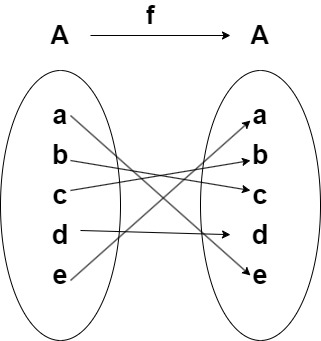
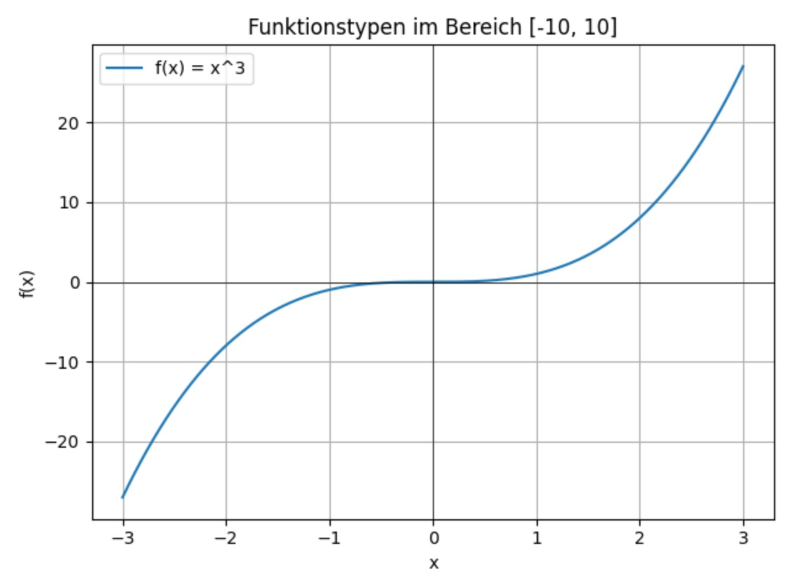

# Teste dich selbst

## Relevante Lernziele für die Prüfung vom 12.6.2025
***Mengenlehre und Mengenopeartionen***
- Du kennst die wichtigsten mathematischen Zahlenmengen wie $\mathbb{N}$, $\mathbb{Z}$, $\mathbb{Q}$, $\mathbb{R}$ und $\mathbb{P}$.
- Du kannst Zahlen den richtigen Mengen zuordnen.
- Du verstehst, was eine leere Menge ist und wie man Teilmengen aufzählt.
- Du kannst einfache Mengenoperationen wie Vereinigung, Schnitt und Differenz anwenden.
- Du weisst, was eine Potenzmenge einer Menge ist.

***Funktionen***
- Du verstehst den Begriff einer mathematischen Funktion als eindeutige Zuordnung.
- Du kennst den Unterschied zwischen injektiven, surjektiven und bijektiven Abbildungen.
- Du erkennst typische Formen wie konstante, lineare, polynomielle und exponentielle Funktionen.

***Logische Operatoren***
- Du kennst die Wahrheitstabellen und Operatorsymbole für die Operatoren 
    - Negation: $\neg x$, $\overline{x}$
    - Logisches Und: $x \land y$, $x \cdot y$
    - Logisches Oder: $x \lor y$, $x + y$
    - Logisches exklusives Oder: $x \oplus y$
    - Implikation: $x \Rightarrow y$
    - Äquivalenz: $x \Leftrightarrow y$
- Du kennst die wichtigsten Rechenregeln. Dies sind namentlich
    - die Assoziativ- und Kommutativgesetze,
    - die beiden Distributivgesetze und
    - die beiden de Morgan Regeln.

- Du kannst beweisen, ob zwei logische Ausdrücke gleichwertig sind, indem du die entsprechenden Wahrheitstabellen vegleichst.
- Du kannst zusammengesetzte textuelle Aussagen in logische boolsche Formeln überführen und diese Aussagen somit auf ihren Wahrheitsgehalt 
überprüfen.
## Typische Prüfungsaufgaben

### Aufgabe 1
In welchen Mengen (Auswahl: $\mathbb{N}, \mathbb{Z}, \mathbb{Q}, \mathbb{R}, \mathbb{P}$) ist $\sqrt {121}$ als Element enthalten?

### Aufgabe 2
Finde ein Gegenbeispiel für die folgende Aussage:

Für beliebige Mengen $A$, $B$, $C$ gilt: $A \cup (B \cap C) = C \cup (B \cap A)$

### Aufgabe 3
Für welche der folgenden Paare der Mengen $A$ und $B$ gilt $A \subseteq B$? Begründe deine Antwort.

* (a): $A = \{3, 7, 1025\}$, $B = \{m \mid m = 2^n -1, \text{für eine natürliche Zahl n}\}$
* (b): $A = \emptyset$, $B = \{0\}$

### Aufgabe 4
Was ist die Potenzmenge der Menge $A = \{a, b, c\}$ ?

### Aufgabe 5
Sei E die Menge aller Menschen auf der Erde. Spezifiert folgende Aussage eine korrekte Funktion von E nach E? Begründe deine Antwort und erwähne alle Annahmen, welche du triffst.

* $f(x)$ ist die Schwester von $x$.

### Aufgabe 6
Betrachte folgende Funktion f:

Welche der folgenden Aussagen (1) bis (5) treffen zu? Begründe deine Antwort.

* (1) f ist eine Injektion.
* (2) f ist eine Surjektion.
* (3) f ist eine Bijektion.
* (4) f ist keine Funktion.
* (5) keine der oben genannten Aussagen ist korrekt.

### Aufgabe 7
Betrachte folgende Funktion $f: \mathbb{R} \Rightarrow \mathbb{R}$

Welche der folgenden Aussagen (1) bis (5) treffen zu? Begründe deine Antwort.

* (1) f ist eine Injektion.
* (2) f ist eine Surjektion.
* (3) f ist eine Bijektion.
* (4) f ist keine Funktion.
* (5) keine der oben genannten Aussagen ist korrekt.

### Aufgabe 8
Ist es möglich eine Funktion $f: \mathbb{N} \Rightarrow \mathbb{N}$ zu konstruieren, welche eine Surjektion aber keine Injektion ist? Begründe deine Antwort.

### Aufgabe 9
Beweise das folgende de Morgan Gesetz für beliebige Werte der boolschen Variablen x und y:
$$ \lnot (x \land y) = \lnot x \lor \lnot y) $$

### Aufgabe 10
Beweise das erste Distributivgesetz für beliebige Werte der boolschen Variablen x, y und z
$$ (x \lor y) \land z = (x \land z) \lor (y \land z)$$

### Aufgabe 11
Sind folgende beide Aussagen logisch gleichwertig oder unterschiedlich:

* "falls a eine Primzahl ist dann ist a eine ungerade Zahl"
* " a ist keine Primzahl oder a ist eine ungerade Zahl"

Begründe deine Antwort (Tip: Bilde aus den beiden Sätzen boolsche Ausdrücke und vergleiche dann die beiden Wahrheitstabellen)

